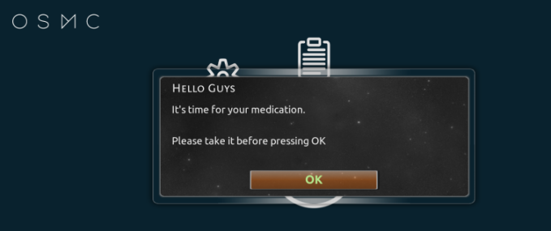

** Much thanks to the work of zed's Hello World and robweber's cronxbmc for making this addon so very easy to implement **

## Kodi Medication Reminder
I wrote this addon to help my elderly parents remember to take their medication at the right times. After not responding very well to simple alarms, I decided an on screen reminder would help make sure that at least one of them would be likely to see an explicitly worded reminder placed in front of them, as they enjoy using Kodi quite often.

I'm not sure if this will be of interest to anyone else, but I thought I'd post it just in case.

To get timed reminders, you need to use this user.notification script to present the xbmc GUI dialog window and robweber's cronxbmc (https://github.com/robweber/cronxbmc) to run the addon directly from kodi at the appropriate times.

Here a screenshot of what the reminder looks like using the Metropolis skin.

##Install Open Notification addon
Installing the script.user.notification-master.zip file will give you the User Notification program addon, which you can test run to simply display the notification GUI shown in the screenshot above.

The text is hardcoded, but can be modified to serve whatever reminder needs you have at ~/.kodi/addons/script.user.notification-master/user.notification.py

##Install cronxbmc - Cron for Kodi
In order to execute the script, cron needs to be executed directly from the Kodi environment.  To do this, you'll need to install robweber's cronxbmc from https://github.com/robweber/cronxbmc

There are some known issues with the cronxbmc GUI crashing kodi on exit in some environments, but the service component works fine and you can set the timing by modifying the cron.xml file directly at ~/.kodi/userdata/addon_data/service.cronxbmc/cron.xml, using the usual cron format.

I've included my cron.xml file in the github repository, which you can place directly at the path specified above, and which will execute the user.notification script at 7:30am and 7:30pm every day.

Information on cron formatting can be found here: https://en.wikipedia.org/wiki/Cron
